# InventoryApi
This is a simple inventory Application restapi service deployed in minikube using external postgres database( we can also deploy postgres in kubenetes but it needs a persistent store) having an external database has its advantage since we dont not need to worry much about the maintenance of database . We can also deploy this in any cloud platform along with rdms as service.
## Introduction
InventoryApi service maintains the inventory list of hostname, ipaddress ,which environment whether it is developement or production or staging and also the application running on the server. The user needs to input the data and this gets stored in postgres database and can be used for easy retrival

## Deployment of InventoryApi
I have deployed this in my vagrant environment with KVM as my driver. My vagrantfile is compatible with virtualbox and parallel platform. We can also deploy this in cloud environment

**Bring up the minikube and locally installed postgres environment**
```
vagrant up
```
This roughly takes about 10 to 15 minutes depending upon your system configuratiion . I have given 4GB as my vm memory

**Deploying of inventory flask api script**
I have already build the image and the code is present my this repository under **app.py**

You can find the image here
[InventoryApi](https://hub.docker.com/r/sunilsankar/inventoryapi)

Ansible has provisioned postgres created a database named inventory and also reset postgres password to **postgres** we can change this if necessary and also allowed public access .We can validate by connecting with the below ipaddress taken from vagrant file
```
vagrant ssh
```
```
psql -U postgres -h 172.16.16.100 -d inventory
```
Now we can deploy the restapi service
### Step1
First we need to deploy metallb since minikube we need to do a tunnel to validate LoadBalancer setup .This solves the issue when we deploy kubernetes in inhouse setup. For details [Metallb](https://metallb.universe.tf/).

Deploy metallb service
```
kubectl apply -f https://raw.githubusercontent.com/google/metallb/v0.8.1/manifests/metallb.yaml
```
Now need to get the ipaddress of minikube
```
minikube ip
```
```
vagrant@inventoryapiminikube:~$ minikube ip
192.168.121.105
vagrant@inventoryapiminikube:~$ 

```
Metallb Layer2 Configuration:
For more details on Layer2 Configuration. Please refer to [Metallblayer2](https://metallb.universe.tf/configuration/#layer-2-configuration)

Create a Yaml file taking the minikube ipaddress and deciding the range
**config.yaml**
```
apiVersion: v1
kind: ConfigMap
metadata:
  namespace: metallb-system
  name: config
data:
  config: |
    address-pools:
    - name: default
      protocol: layer2
      addresses:
      - 192.168.121.220-192.168.121.249
```
Deploy the configuration
```
kubectl create -f config.yml
```
### Step2
Deployment of inventory api
1. Deployment of secret.yaml which contains the postgres password in  encrypted test . Here the postgres password is postgres
```
kubectl create -f Secret.yaml

```
2. Run the deployment of inventoryapi
```
kubectl create -f Deployment.yaml
```
3. Deployment of Service to access the restapi
```
kubectl create -f Service.yaml
```
Once the service is deployed you should be able to see the ipaddress
```
vagrant@inventoryapiminikube:/vagrant$ kubectl get svc
NAME           TYPE           CLUSTER-IP      EXTERNAL-IP       PORT(S)        AGE
inventoryapi   LoadBalancer   10.103.105.81   192.168.121.220   80:31050/TCP   12s
kubernetes     ClusterIP      10.96.0.1       <none>            443/TCP        8m34s
vagrant@inventoryapiminikube:/vagrant$ 
```
We now see an external ip and we can use this to access the api
```

```
### Testing the restapi
```
vagrant@inventoryapiminikube:/vagrant$ curl http://192.168.121.220
{"message":"The is a inventory script"}
vagrant@inventoryapiminikube:/vagrant$ 
```

Using postman running GET 
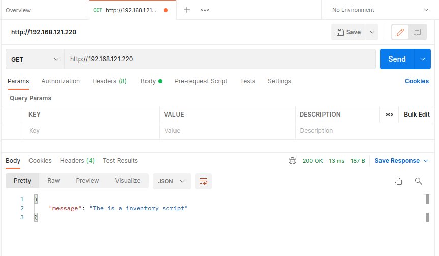

Posting Inventory using POST method
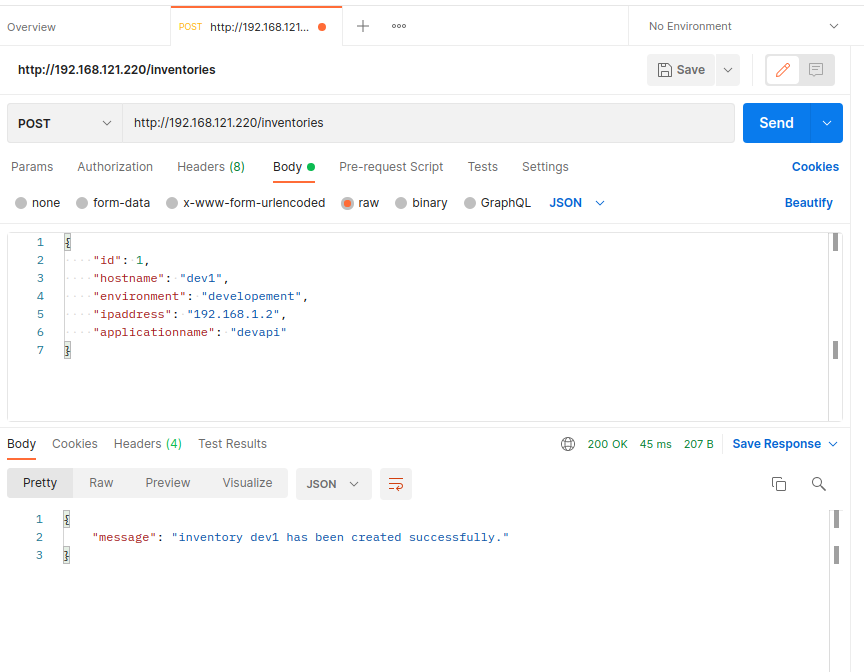

Getting the inventory list
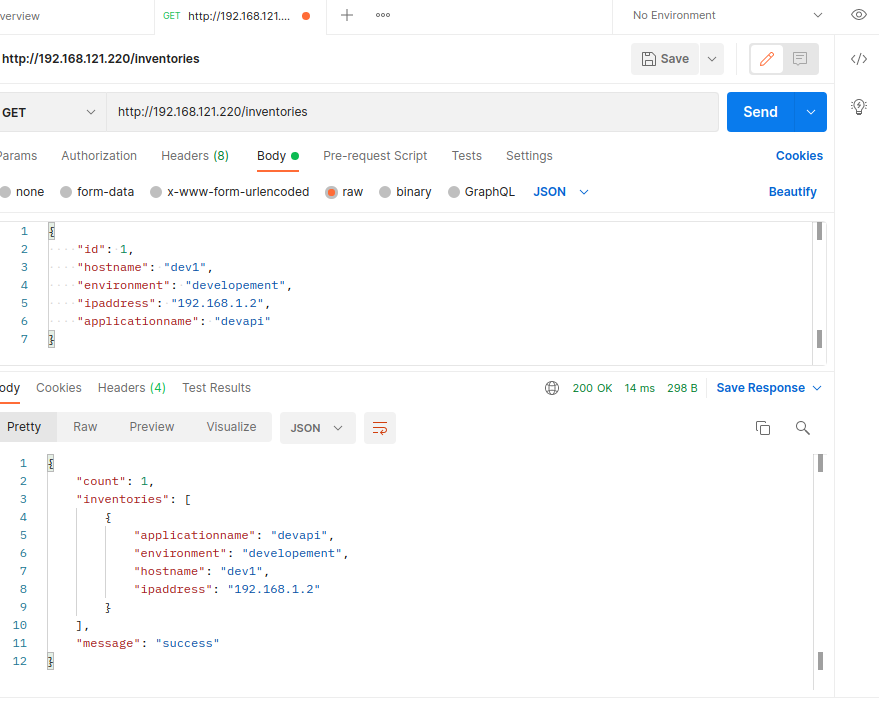

### Step 3 Adding Monitoring 
Helm is already installed when we provisioned minikube.
1. deploying prometheus
Adding the proemetheus repo
```
helm repo add prometheus-community https://prometheus-community.github.io/helm-charts
```
Deploying helm chart
```
helm install prometheus prometheus-community/prometheus
```
Modify the service of prometheus server to Loadbalancer
```
vagrant@inventoryapiminikube:/vagrant$ kubectl get svc
NAME                            TYPE           CLUSTER-IP      EXTERNAL-IP       PORT(S)        AGE
inventoryapi                    LoadBalancer   10.103.4.15     192.168.121.220   80:30542/TCP   4m34s
kubernetes                      ClusterIP      10.96.0.1       <none>            443/TCP        71m
prometheus-alertmanager         ClusterIP      10.99.20.98     <none>            80/TCP         54s
prometheus-kube-state-metrics   ClusterIP      10.103.153.31   <none>            8080/TCP       54s
prometheus-node-exporter        ClusterIP      None            <none>            9100/TCP       55s
prometheus-pushgateway          ClusterIP      10.110.106.26   <none>            9091/TCP       54s
prometheus-server               ClusterIP      10.102.53.117   <none>            80/TCP         55s
vagrant@inventoryapiminikube:/vagrant$ 
```
```
vagrant@inventoryapiminikube:/vagrant$ kubectl edit svc prometheus-server
```
Change from 
```

apiVersion: v1
kind: Service
metadata:
  annotations:
    meta.helm.sh/release-name: prometheus
    meta.helm.sh/release-namespace: default
  creationTimestamp: "2021-11-24T12:42:06Z"
  labels:
    app: prometheus
    app.kubernetes.io/managed-by: Helm
    chart: prometheus-14.11.1
    component: server
    heritage: Helm
    release: prometheus
  name: prometheus-server
  namespace: default
  resourceVersion: "3802"
  uid: ebd191aa-f6cf-40eb-9d66-de7d3a8b2432
spec:
  clusterIP: 10.102.53.117
  clusterIPs:
  - 10.102.53.117
  internalTrafficPolicy: Cluster
  ipFamilies:
  - IPv4
  ipFamilyPolicy: SingleStack
  ports:
  - name: http
    port: 80
    protocol: TCP
    targetPort: 9090
  selector:
    app: prometheus
    component: server
    release: prometheus
  sessionAffinity: None
  type: ClusterIP
status:
  loadBalancer: {}

```
Change to
```
apiVersion: v1
kind: Service
metadata:
  annotations:
    meta.helm.sh/release-name: prometheus
    meta.helm.sh/release-namespace: default
  creationTimestamp: "2021-11-24T12:42:06Z"
  labels:
    app: prometheus
    app.kubernetes.io/managed-by: Helm
    chart: prometheus-14.11.1
    component: server
    heritage: Helm
    release: prometheus
  name: prometheus-server
  namespace: default
  resourceVersion: "3802"
  uid: ebd191aa-f6cf-40eb-9d66-de7d3a8b2432
spec:
  clusterIP: 10.102.53.117
  clusterIPs:
  - 10.102.53.117
  internalTrafficPolicy: Cluster
  ipFamilies:
  - IPv4
  ipFamilyPolicy: SingleStack
  ports:
  - name: http
    port: 80
    protocol: TCP
    targetPort: 9090
  selector:
    app: prometheus
    component: server
    release: prometheus
  sessionAffinity: None
  type: LoadBalancer
status:
  loadBalancer: {}


```
Now we will see the ipaddress
```
vagrant@inventoryapiminikube:/vagrant$ kubectl get svc
NAME                            TYPE           CLUSTER-IP      EXTERNAL-IP       PORT(S)        AGE
inventoryapi                    LoadBalancer   10.103.4.15     192.168.121.220   80:30542/TCP   7m26s
kubernetes                      ClusterIP      10.96.0.1       <none>            443/TCP        74m
prometheus-alertmanager         ClusterIP      10.99.20.98     <none>            80/TCP         3m46s
prometheus-kube-state-metrics   ClusterIP      10.103.153.31   <none>            8080/TCP       3m46s
prometheus-node-exporter        ClusterIP      None            <none>            9100/TCP       3m47s
prometheus-pushgateway          ClusterIP      10.110.106.26   <none>            9091/TCP       3m46s
prometheus-server               LoadBalancer   10.102.53.117   192.168.121.221   80:31397/TCP   3m47s
vagrant@inventoryapiminikube:/vagrant$ 

```
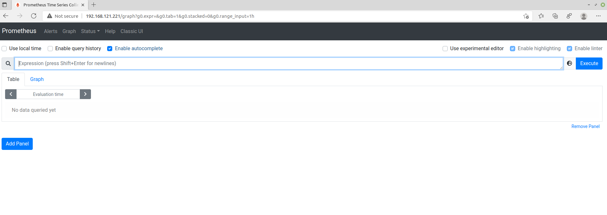
2. Deploying Grafana
Adding helm repo
```
helm repo add grafana https://grafana.github.io/helm-charts
```
Running the helm chart
```
helm install grafana grafana/grafana
```
Changing type from ClusterIP to LoadBalancer
```
vagrant@inventoryapiminikube:/vagrant$ kubectl edit svc grafana

```
```
vagrant@inventoryapiminikube:/vagrant$ kubectl get svc
NAME                            TYPE           CLUSTER-IP      EXTERNAL-IP       PORT(S)        AGE
grafana                         LoadBalancer   10.109.153.35   192.168.121.222   80:30287/TCP   2m45s
inventoryapi                    LoadBalancer   10.103.4.15     192.168.121.220   80:30542/TCP   15m
kubernetes                      ClusterIP      10.96.0.1       <none>            443/TCP        82m
prometheus-alertmanager         ClusterIP      10.99.20.98     <none>            80/TCP         11m
prometheus-kube-state-metrics   ClusterIP      10.103.153.31   <none>            8080/TCP       11m
prometheus-node-exporter        ClusterIP      None            <none>            9100/TCP       11m
prometheus-pushgateway          ClusterIP      10.110.106.26   <none>            9091/TCP       11m
prometheus-server               LoadBalancer   10.102.53.117   192.168.121.221   80:31397/TCP   11m
vagrant@inventoryapiminikube:/vagrant$ 

```
Get the admin password
```
kubectl get secret --namespace default grafana -o jsonpath="{.data.admin-password}" | base64 --decode ; echo
```
SAmple Output
```
vagrant@inventoryapiminikube:/vagrant$ kubectl get secret --namespace default grafana -o jsonpath="{.data.admin-password}" | base64 --decode ; echo
u9k4Y2S1puPYQrQhUTxT4XEA0qCG56pHzBpOsyDB
vagrant@inventoryapiminikube:/vagrant$
```
### Configure Grafana ###
Login to grafana
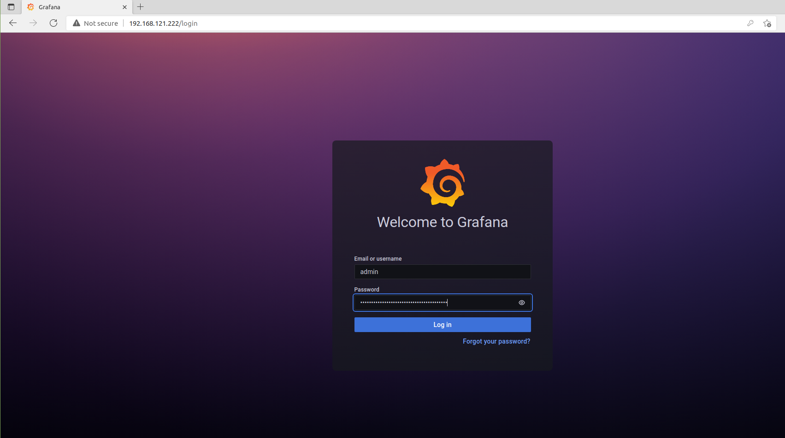

Configure prometheus datasource
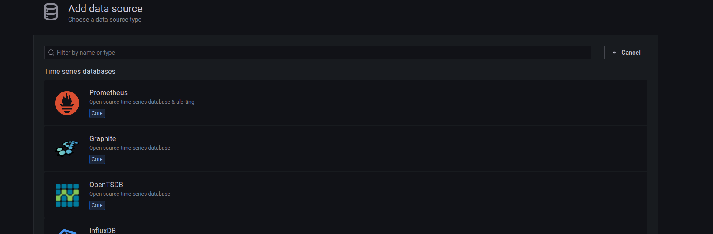

Configure the url with prometheus loadbalancer ipaddress and save
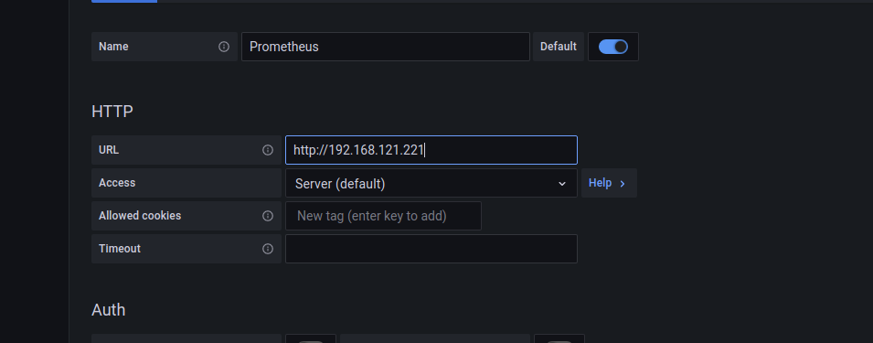

Configure dashboard
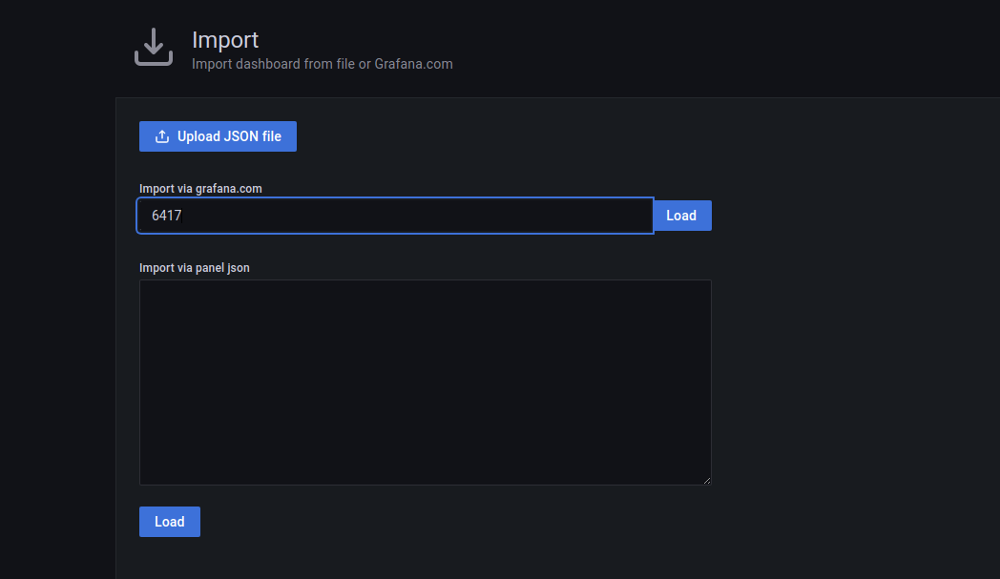

Taking already available dashboard using the number 6417

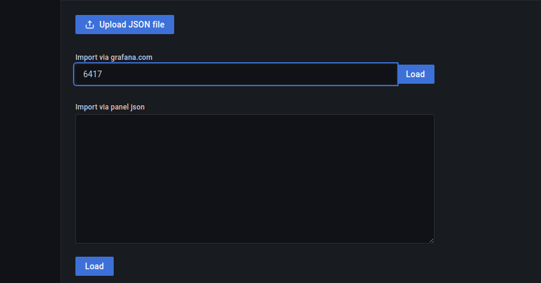

Then we need to choose prometheus as a datasource

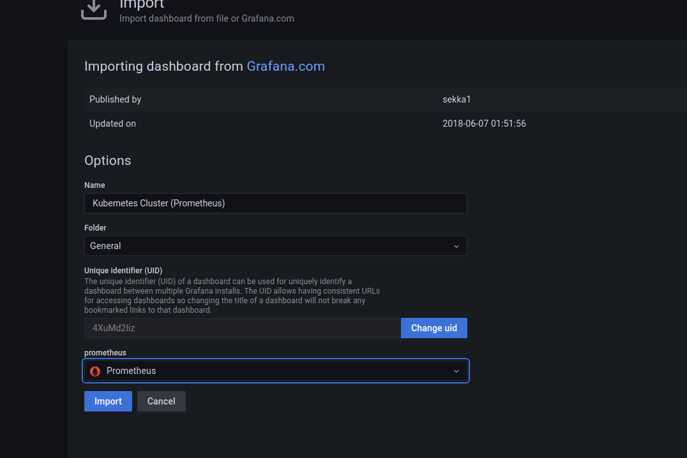

Finally the dashboard looks like this

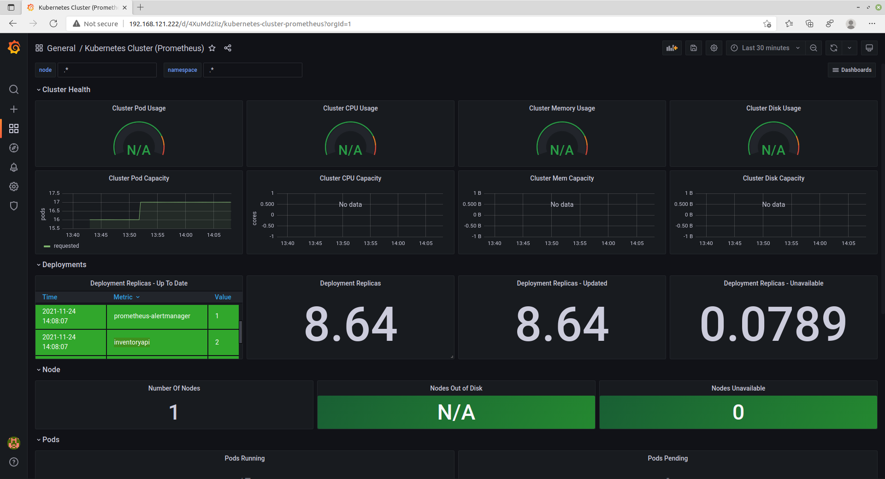

The above dashboard is used for monitoring the peformance of kubernetes

For monitoring logs configuring Loki to capture the logs
Installing loki via helm
```
helm upgrade --install loki grafana/loki-stack
```
Changing the service of loki from type ClusterIP to LoadBalancer
```
vagrant@inventoryapiminikube:/vagrant$ kubectl edit svc loki
```
```
vagrant@inventoryapiminikube:/vagrant$ kubectl get svc
NAME                            TYPE           CLUSTER-IP      EXTERNAL-IP       PORT(S)          AGE
grafana                         LoadBalancer   10.109.153.35   192.168.121.222   80:30287/TCP     76m
inventoryapi                    LoadBalancer   10.103.4.15     192.168.121.220   80:30542/TCP     89m
kubernetes                      ClusterIP      10.96.0.1       <none>            443/TCP          156m
loki                            LoadBalancer   10.107.28.68    192.168.121.223   3100:31038/TCP   24m
loki-headless                   ClusterIP      None            <none>            3100/TCP         24m
prometheus-alertmanager         ClusterIP      10.99.20.98     <none>            80/TCP           85m
prometheus-kube-state-metrics   ClusterIP      10.103.153.31   <none>            8080/TCP         85m
prometheus-node-exporter        ClusterIP      None            <none>            9100/TCP         85m
prometheus-pushgateway          ClusterIP      10.110.106.26   <none>            9091/TCP         85m
prometheus-server               LoadBalancer   10.102.53.117   192.168.121.221   80:31397/TCP     85m
vagrant@inventoryapiminikube:/vagrant$

```
Configure datasource as loki in Gafana
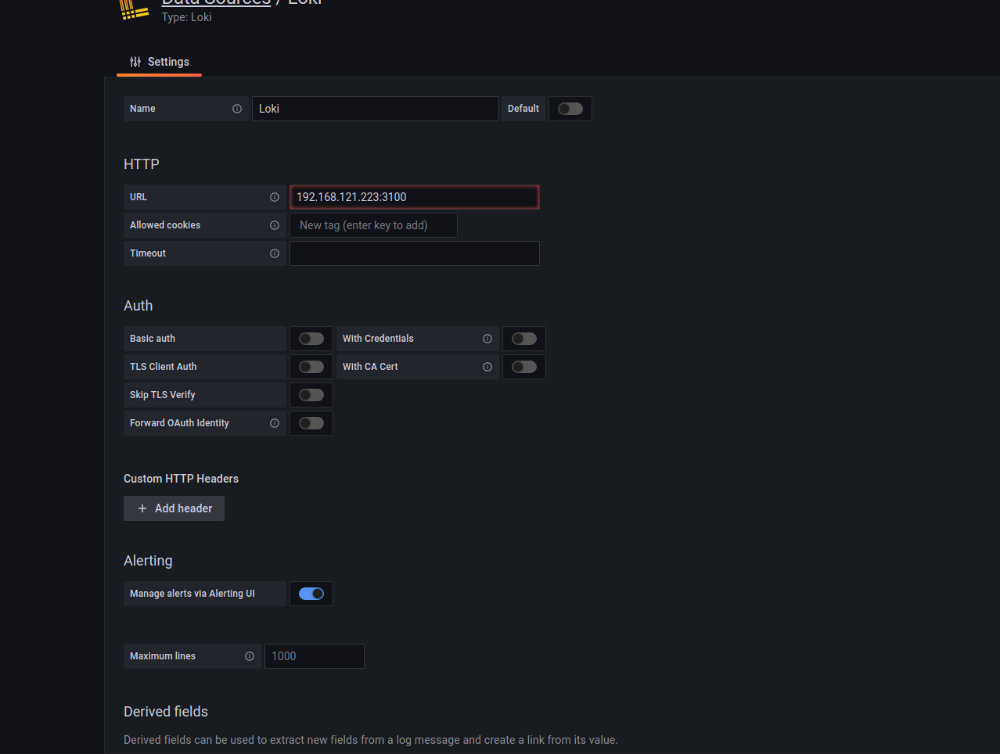

When you go under explorer you will see the logs
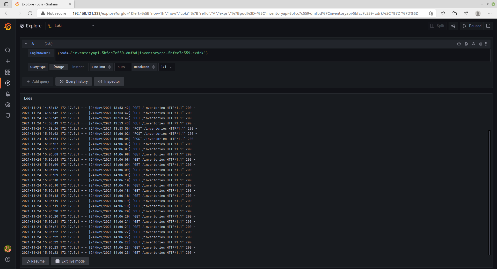
